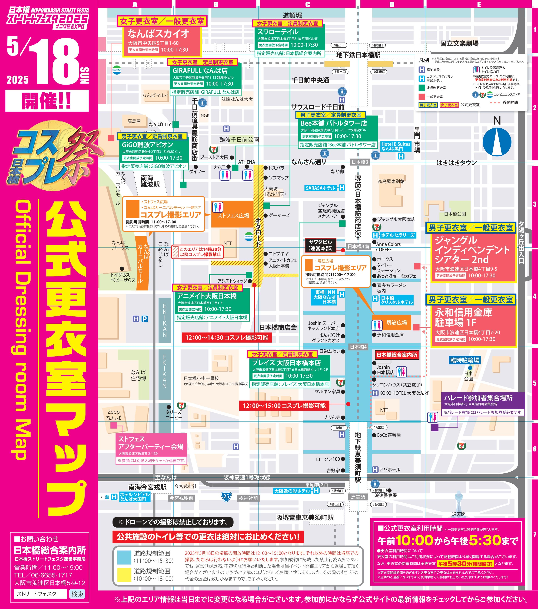
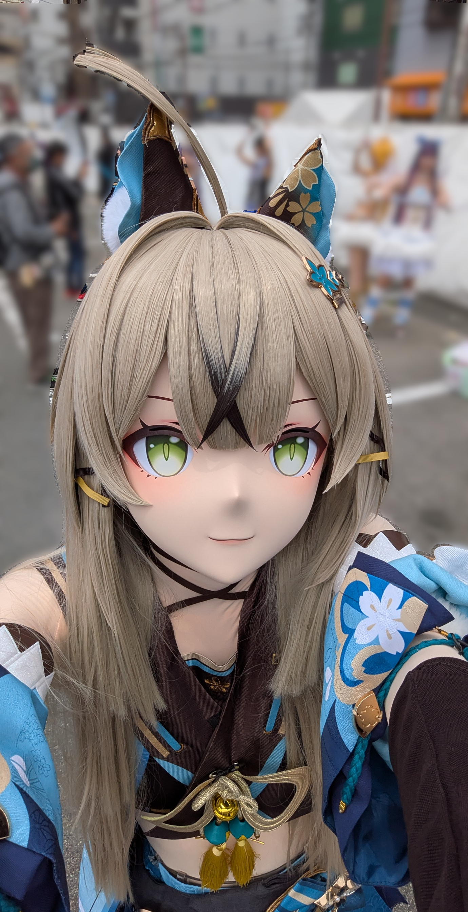
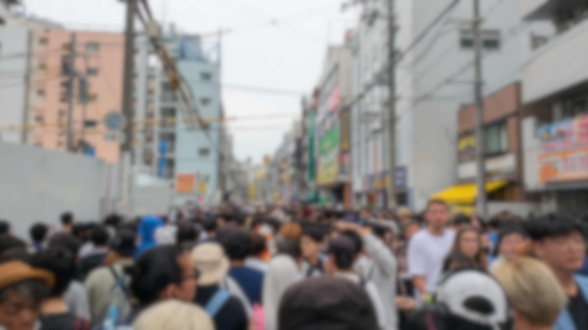

ちょうど近くでストフェスがあったので行って着ました。

## ストフェスとは

正式名称：日本橋ストリートフェスタ  
大阪日本橋(にっぽんばし)で行われる国内最大規模のコスプレイベントです。  

<!--  -->

マップ(公式Xより)

## 行ってみて

### 前半(11時~14時頃)

着てました。  
さすがに大規模イベントだけあって人はそれなりにいましたが、午後に比べると人は少なかったです。  
ただ、午前でも開始してから少し時間が経つと、撮影スペースに空きがない状態でした。  
お昼頃になると、人がだんだんと増えてきました。  

<!--  -->

自撮りがムズイ

### 後半(14時~16時頃)

サポートしてました。  
もうこの時間帯になると、どこに行っても人が沢山いるという状況でした。  
撮影場所が空いてないどころか、場所によっては撮影場所に近づくことすら困難な状況でした。  
ストフェス広場周辺は、人の海のようで移動するのも大変でした。  

3時過ぎのオタロード

### 更衣室

自分が使用したのは定員制更衣室でした。  
更衣室は9時にオープンしましたが、9時30分ごろに行ったので、思ったよりも人がいました。  
ただ思っていたよりはスムーズにスペースが空いた気がします。  
一般の更衣室の方は使っていないのでコメント出来ませんが、出来れば定員制が良い気がします。

### サポート

ただブラブラするだけなら、サポートは2人か最低1人はいた方が良いと思います。  
撮影するのであれば、着ぐるみさんに対してサポート2人、カメラ1人の4人体制が安心かなと思いました。  
人が多いのでサポートでも大変です。

### パレード

ストフェスではパレードがあります。  
自分は参加していませんが、終わってからストフェスの動画を見るとだいたいパレードの動画があったので、いろんな人(現地以外の人含む)に見てもらいたい人には良いと思います。

### 行って感じたストフェスの利点&欠点

ストフェスの特徴は、とにかく人が多いことだと思います。

#### 利点

- コスプレイベントかつ人が多いので一般の人やレイヤーさんからの反応がある
  - 一般のお客さんからもかなり写真撮影を求められました
  - 自分は初だったので反応があることに驚きました
- これ以上の混雑はないのではレベルで混んでいるので、人が多いときにどうすればよいかの勉強になる
  - 行ったことはありませんが並ぶのはコミケとかでしょうか

#### 欠点

- 人にぶつかったりしないように周りを見る必要があり大変
  - 着ていようがサポートであろうが変わりないと思います
- 撮影場所には限りがあり、流動があまりない
  - 撮影可能時間になったら、すぐに撮影可能場所へ行って撮影したほうが良いと思いました
- コスプレイベントかつ路上で人が多いからか、座る場所がなく着ててもサポしててもずっと立ちっぱなし
  - 長時間となるときついです

### 目的別結論

- 撮影したい！：午前にとっとと撮影
- 人に見てもらいたい、ぶらぶらしたい：パレード参加&午後適当に散歩
- 全部やりたい！：更衣室が空く時間に行き、ずっと参加(ハードです)

## 個人的振り返り

### 犯した過ち等(ごめんなさい)

- 定員制の更衣室でもらった引き換え用の紙を約3分でなくす
  - ちなみに家に帰っても見つからなかったのでマジの紛失、(もしかしたら自分は紛失を司る神なのでは？と思った、店員さん、その節はご迷惑をおかけしました…)
- 着てるときの行先を他の人にほぼ委ねる
  - "参加すること"が目的になってて着れた時点で割と満足してしまってました…
- ミラ子からもらったたこ焼きの箸を落とす
- 行くところを勘違いして道を逆走しそうになる

#### 過ちではないけどトラブル

- 着るときに綺良々の胸の鈴を付けようとしたら外れて焦る
  - ただし持ってきていた細い針金で緊急補修して誰にも気づかれず終わる、有能

壊れた飾り

### 感想

- 2回目のイベントで初外イベをストフェスにしたのは中々の冒険だった
- 事前にルートを完全に決めておいたほうが良い
- ポーズのレパートリーが貧弱過ぎて困ったのでもっと色々ポーズを取れるようになっていたほうが良いと思った
- 来年もあるなら参加したい

終わり～