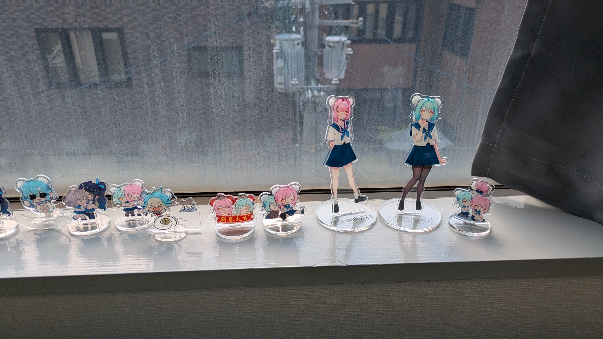

着ぐるみを製作している河妖工房の実店舗が大阪にできると聞き、行ってきました！

## 店舗が入っているビルまで移動

最寄り駅に到着し、店舗が入っているビルへ徒歩で向かいました。  
8月頭のお昼過ぎということでもちろん外はアツアツでしたが、駅から数分で到着しました。  
10分もかかっていないので、立地はかなり良いと思います。  

流石界隈では有名な工房だけあり、自分が来た時点で数人の方が並んでいました。

## いざ入店

開店時間になり、エレベーターで店舗が入っているフロアへ移動！  
入口には河妖屋の標識？がありました。(写真撮り忘れました)  

予約番号を伝えた後、スリッパに履き替え店内に入ってみると、着ぐるみのお面がずらりと並んでいました！

  

棚には着ぐるみだけではなくドールスーツやドール面なども…(GitHubの規約に配慮して一部モザイク)

  

  
壁には着ぐるみの写真も貼ってありました！(with ミクさん)

  
窓辺には河妖屋のキャラクター、春巻と花巻のグッズも置いてありました。可愛い！

  
写真に撮れてはいませんが、その他には

- 腰掛ける用の箱型の椅子がいくつか
- 更衣用のテント1つ
- 配布されているマスク(着ぐるみのお面ではなくこっち→😷)

等がありました！

店内の広さは、何十人もの人が入るほどではありませんが、5～6人でぎりぎりというわけでもないサイズ感でした。  
実際の広さは公式Xが上げられている画像が参考になると思います。  
[搬入前の店舗内の様子](https://x.com/HeyaoFetish/status/1949056856867156443/photo/1)

また、店内にはスタッフさんが数人いて、来店した人からの注文方法や着ぐるみについての質問に答えていました。  
直接質問できるので、疑問点があっても安心です。

あと8月ということもあり、もちろんクーラーが効いていたので、着ぐるみさんにも安心の環境でした。

## 行って見ての感想

着ぐるみのお面が沢山並んでいる光景自体、なかなか見ることができないので、着ぐるみが好きな方はテンションが上がると思います。やっぱり画像で見るのと実物を見るのは違います。  
今回、試着できる着ぐるみは1点のみだったようなのですが、次回は試着可能な着ぐるみが増えるそうなので、期待が膨らみます！

店舗の内容とは直接関係がないのですが、着ぐるみ界隈の人達で会話が生まれていて何か良いなあと思いました。(店舗の趣旨とはずれていることは承知です)

着ぐるみさん的な要望を挙げるとするならば、鏡があればさらに良いと感じました。  
あと現状大阪では着ぐるみのイベントが皆無なので、何かイベントやってください！(欲張り)

結論！着ぐるみが好きな方はとりあえず行って損なしだと思います！

おわり
